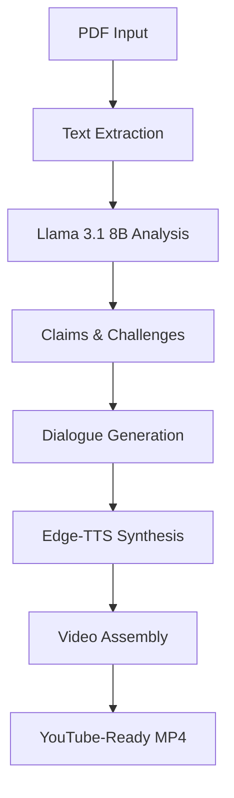

# 

<!-- Badges -->


> **Transform academic research papers into engaging YouTube videos using AI-powered debate generation**

An automated system that processes PDF research papers through sophisticated AI models to create professional video content featuring academic debates between expert personas, complete with multi-voice narration and visual branding.

## Table of Contents

- [Overview](#overview)
- [Demo](#demo)
- [Quick Start](#quick-start)
- [Installation](#installation)
- [Project Structure](#project-structure)
- [Usage](#usage)
- [AI Components](#ai-components)
- [Configuration](#configuration)
- [Performance](#performance)
- [Troubleshooting](#troubleshooting)
- [Contributing](#contributing)
- [Roadmap](#roadmap)
- [Citation](#citation)
- [License](#license)
- [Contact](#contact)

## Overview

### What It Does

AI Paper Narrator transforms dense academic papers into accessible video content through:

1. **Intelligent Analysis**: Extracts key claims, research contributions, and potential criticisms
2. **Debate Generation**: Creates balanced discussions between optimistic and skeptical researcher personas
3. **Voice Synthesis**: Generates natural speech with distinct AI voices for each character
4. **Video Production**: Assembles professional videos with speaker images, text overlays, and branding

### Key Features

- **Advanced Text Processing**: Robust PDF extraction and academic content understanding
- **AI-Powered Analysis**: Local Llama 3.1 8B model for privacy-focused processing
- **Multi-Voice Synthesis**: Microsoft Edge-TTS with character-specific voices
- **Professional Output**: YouTube-ready MP4 videos with 1080p quality
- **Customizable Branding**: Support for logos, speaker images, and visual themes
- **Batch Processing**: Handle multiple papers efficiently
- **Quality Control**: Built-in error handling and content validation

### Use Cases

- **Academic Outreach**: Make research accessible to broader audiences
- **Educational Content**: Create engaging materials for students and professionals
- **Research Communication**: Help researchers share their work effectively
- **Content Creation**: Generate discussion-worthy content for academic channels

## Demo

### Sample Output

**Input**: Research paper PDF (e.g., "Community Detection in Large-Scale Networks")

**Output**: Professional video featuring:
- 6-second branded intro with logo animation and sound
- Academic debate between Dr. Ava D. (optimistic) and Prof. Marcus W. (skeptical)
- Speaker images with name overlays
- Natural AI-generated voices with distinct personalities
- 6-second branded outro

**Typical Duration**: 6-10 minutes depending on paper complexity

### Video Structure Example

```
📽️ Logo Intro (6s) → 📋 Title Screen (3s) → 👩‍🔬 Dr. Ava Analysis (2-3min)
→ 🔄 Transition (5s) → 👨‍🎓 Prof. Marcus Critique (2-3min) → 📽️ Logo Outro (6s)
```

### Processing Pipeline Visualization

```
PDF Input → Text Extraction → AI Analysis → Debate Generation
    ↓             ↓              ↓            ↓
Research    →  Key Claims  →  Personas  →  Voice Synthesis
Paper           & Critics     Arguments     & Video Assembly
                                              ↓
                                        YouTube-Ready MP4
```

## Quick Start

### Prerequisites Check

```bash
# Verify you have required resources
python3 --version  # Should be 3.8+
free -h            # Should show 8GB+ available RAM
```

### One-Command Setup

```bash
# Download and run setup script
curl -fsSL https://raw.githubusercontent.com/yourusername/ai_paper_narrator/main/setup.sh | bash
```

### Manual Setup (Recommended)

```bash
# 1. Install Ollama (AI model server)
curl -fsSL https://ollama.ai/install.sh | sh

# 2. Start Ollama service
ollama serve &

# 3. Download AI model (this may take 10-15 minutes)
ollama pull llama3.1:8b

# 4. Install system dependencies
# Ubuntu/Debian:
sudo apt update && sudo apt install -y ffmpeg sox
# macOS:
# brew install ffmpeg sox

# 5. Clone and setup Python environment
git clone <your-repo-url>
cd 
python3 -m venv venv
source venv/bin/activate
pip install -r requirements.txt

# 6. Add your media assets
mkdir -p data/materials
# Copy your speaker images: HOST.JPG, AVA.JPG, MARCUS.JPG
# Copy your logo video: LOGO_1080p.MOV

# 7. Process your first paper!
python3 generate_complete_video.py path/to/your/paper.pdf
```

### First Run Test

```bash
# Test with a sample paper (if you have one)
python3 generate_complete_video.py data/input/sample_paper.pdf

# Check output
ls -la data/output/  # Should see generated video files
```

## Installation

### System Requirements

| Component | Minimum | Recommended |
|-----------|---------|-------------|
| **RAM** | 6GB | 12GB+ |
| **Storage** | 10GB free | 20GB+ free |
| **CPU** | 4 cores | 8+ cores |
| **Python** | 3.8+ | 3.9+ |
| **Internet** | Required for voice synthesis | Stable broadband |

### Platform Support

- ✅ **Linux** (Ubuntu 20.04+, tested)
- ✅ **macOS** (10.15+, tested)
- ⚠️ **Windows** (10/11, experimental support)

### Detailed Setup

#### 1. Install System Dependencies

**Ubuntu/Debian:**
```bash
sudo apt update
sudo apt install -y python3 python3-pip python3-venv ffmpeg sox git curl
```

**macOS:**
```bash
# Install Homebrew if not already installed
/bin/bash -c "$(curl -fsSL https://raw.githubusercontent.com/Homebrew/install/HEAD/install.sh)"

# Install dependencies
brew install python ffmpeg sox git
```

**Windows:**
```powershell
# Install via Chocolatey (install chocolatey first if needed)
choco install python ffmpeg git
```

#### 2. Install and Configure Ollama

```bash
# Install Ollama
curl -fsSL https://ollama.ai/install.sh | sh

# Start Ollama (will run in background)
ollama serve

# In a new terminal, pull the required model
ollama pull llama3.1:8b

# Verify installation
ollama list  # Should show llama3.1:8b
```

#### 3. Clone Repository and Setup Environment

```bash
# Clone the repository
git clone <your-repo-url>
cd 

# Create virtual environment
python3 -m venv venv

# Activate virtual environment
source venv/bin/activate  # Linux/macOS
# venv\Scripts\activate     # Windows

# Install Python dependencies
## Project Structure

```
/
├── 📄 README.md                              # This file
├── 📋 requirements.txt                        # Python dependencies
├── 📜 LICENSE                                # Project license
├── 🐍 debug_stage3.py               # Core module
├── 🐍 fix_audio_combination.py      # Core module
├── 🎬 generate_paper_audio.py       # Main pipeline entry point
├── 🐍 inspect_dialogue.py           # Core module
├── 🐍 run_phase2_FIXED.py           # Core module
├── 🐍 run_phase3.py                 # Core module
├── 🧪 test_enhanced_claims_challenges.py # Testing module
├── 🧪 test_expert_depth_analysis.py # Testing module
│
├── 📁 src/                                   # Core source modules
│   ├── 🧠 pdf_processor.py                   # PDF text extraction
│   ├── 🤖 enhanced_analyzer.py               # AI-powered paper analysis
│   ├── 🎭 cohesive_dialogue_generator.py     # Academic debate creation
│   ├── 🗣️  audio_generator_fixed_enhanced.py  # Multi-voice speech synthesis
│   ├── 👥 personalities_updated.py          # AI researcher personas
│   └── ⚙️  config.py                         # System configuration
│
├── 📁 data/                                  # Data and media files
│   ├── 📥 input/                             # PDF papers to process
│   │   └── 📄 *.pdf                          # Research papers
│   ├── 📤 output/                            # Generated content
│   │   ├── 🎥 *.mp4                          # Final videos
│   │   ├── 🔊 audio/                         # Speech synthesis files
│   │   └── 📊 *.json                         # Processing metadata
│   └── 🖼️  materials/                        # Visual assets
│       ├── 👤 HOST.JPG                       # Narrator image
│       ├── 👩‍🔬 AVA.JPG                        # Dr. Ava D. image
│       ├── 👨‍🎓 MARCUS.JPG                     # Prof. Marcus W. image
│       └── 🎬 LOGO_1080p.MOV                 # Branding video
│
├── 🧪 tests/                               # Test suite
│   ├── test_*.py                         # Unit tests
│   └── fixtures/                         # Test data
│
├── 📖 docs/                               # Documentation
│   ├── api.md                            # API reference
│   ├── examples/                         # Usage examples
│   └── images/                           # Documentation images
│
└── 📝 logs/                                 # Processing logs (generated)
    ├── analysis.log                        # AI analysis logs
    ├── audio.log                           # Speech synthesis logs
    └── video.log                           # Video generation logs
```

### Key Components

| Component | Purpose | Dependencies |
|-----------|---------|--------------|
| **PDF Processor** | Extract and clean text from research papers | PyPDF2 |
| **Enhanced Analyzer** | AI-powered paper analysis and claims extraction | Ollama/Llama |
| **Dialogue Generator** | Create balanced academic debates | Local AI model |
| **Audio Generator** | Multi-voice speech synthesis | Edge-TTS, FFmpeg |
| **Video Assembler** | Combine audio, images, and branding | MoviePy, PIL |

## Usage

### Basic Usage

```bash
# Process a single paper
python3 main.py path/to/paper.pdf

# Process with custom output directory
python3 main.py paper.pdf --output-dir /path/to/output

# Process multiple papers
python3 main.py papers/*.pdf
```

### Advanced Usage

```bash
# Customize debate length (number of exchanges)
python3 main.py paper.pdf --max-exchanges 8

# Skip logo intro/outro
python3 main.py paper.pdf --no-logo

# Use different AI model
python3 main.py paper.pdf --model llama2:13b

# Debug mode with verbose logging
python3 main.py paper.pdf --debug --verbose

# Generate audio only (no video)
python3 main.py paper.pdf --audio-only
```

### Configuration Files

Create `config.yaml` to customize default settings:

```yaml
# AI Model Settings
model:
  name: 'llama3.1:8b'
  temperature: 0.7
  max_tokens: 2000

# Voice Settings
voices:
  narrator: 'en-US-AriaNeural'
  optimist: 'en-US-JennyNeural'
  skeptic: 'en-US-ChristopherNeural'

# Video Settings
video:
  resolution: '1920x1080'
  fps: 24
  bitrate: '2000k'

# Processing Settings
processing:
  max_exchanges: 6
  include_logo: true
  debug_mode: false
```

## AI Components

### Architecture Overview



### Technology Stack

#### AI Models

**Detected AI Components**: Ollama/Llama 3.1, Microsoft Edge-TTS, OpenAI API

| Model | Provider | Purpose | Location |
|-------|----------|---------|----------|
| **Llama 3.1 8B** | Meta (via Ollama) | Text analysis, dialogue generation | Local |
| **Edge-TTS Neural Voices** | Microsoft | Speech synthesis | Cloud API |

#### Frameworks & Libraries

**Detected Frameworks**: Streamlit, MoviePy, FastAPI, Flask

| Component | Library | Version | Purpose |
|-----------|---------|---------|---------|
| **PDF Processing** | PyPDF2 | 3.0+ | Text extraction from academic papers |
| **Video Processing** | MoviePy | 1.0.3+ | Video composition and rendering |
| **Audio Processing** | Edge-TTS, FFmpeg | Latest | Speech synthesis and audio editing |
| **Image Processing** | Pillow/PIL | 9.5+ | Image manipulation and resizing |
| **HTTP Client** | Requests | 2.28+ | API communication |

### AI Personas Detailed

#### Dr. Ava D. - The Enthusiastic Researcher
- **Voice**: en-US-JennyNeural (Enthusiastic female)
- **Personality**: Optimistic about research potential, focuses on breakthroughs
- **Style**: Explanatory, uses analogies, builds excitement
- **Focus Areas**: Practical applications, future implications, innovation potential

#### Prof. Marcus W. - The Critical Analyst
- **Voice**: en-US-ChristopherNeural (Analytical male)
- **Personality**: Methodologically rigorous, questions bold claims
- **Style**: Precise, asks probing questions, measured tone
- **Focus Areas**: Research limitations, evidence quality, methodological concerns

#### Narrator - The Professional Host
- **Voice**: en-US-AriaNeural (Professional female)
- **Personality**: Neutral, professional, guides discussion
- **Style**: Clear, structured, transitions between segments
- **Focus Areas**: Introduction, transitions, conclusion

## API Reference

### Command Line Interface

```bash
python3 generate_complete_video.py [OPTIONS] PDF_FILE
```

#### Options

| Option | Type | Default | Description |
|--------|------|---------|-------------|
| `--output-dir` | string | `data/output` | Output directory for generated files |
| `--max-exchanges` | integer | `6` | Number of debate exchanges between personas |
| `--model` | string | `llama3.1:8b` | AI model to use for analysis |
| `--no-logo` | flag | `false` | Skip logo intro and outro |
| `--audio-only` | flag | `false` | Generate audio only, skip video assembly |
| `--debug` | flag | `false` | Enable debug mode with detailed logging |
| `--verbose` | flag | `false` | Enable verbose output |
| `--config` | string | `config.yaml` | Custom configuration file |

### Python API

```python
from src.integrated_enhanced_pipeline import IntegratedEnhancedPipeline

# Initialize pipeline
pipeline = IntegratedEnhancedPipeline()

# Check prerequisites
if pipeline.check_prerequisites():
    # Process paper
    result = pipeline.process_paper_complete_video_pipeline(
        pdf_path='path/to/paper.pdf',
        max_exchanges=6
    )
    
    print(f"Video generated: {result['video_output']['video_file']}")
```

### Output Format

The system generates a comprehensive result dictionary:

```json
{
  "source_file": "path/to/input.pdf",
  "processing_time": "180.5 seconds (3.0 minutes)",
  "paper_analysis": {
    "research_field": "Computer Science - Algorithms",
    "paper_topic": "Community Detection in Large Networks",
    "key_finding": "Novel WCC algorithm improves scalability",
    "optimist_points": 5,
    "skeptic_points": 7
  },
  "video_output": {
    "video_file": "data/output/paper_WITH_LOGO_youtube.mp4",
    "duration": 420.3,
    "resolution": "1920x1080",
    "file_size_mb": "85.2"
  },
  "status": "complete_success"
}
```

## Performance

### Benchmarks

Tested on Ubuntu 20.04 with 16GB RAM, Intel i7-10700K:

| Paper Length | Processing Time | Peak RAM | Output Size |
|--------------|----------------|----------|-------------|
| 10 pages | 3-5 minutes | 6GB | 45-60MB |
| 20 pages | 6-10 minutes | 7GB | 80-120MB |
| 30+ pages | 10-15 minutes | 8GB | 120-180MB |

### Performance Factors

**Processing Speed Influenced By**:
- Paper complexity and length
- Available RAM (8GB minimum, 16GB+ recommended)
- CPU cores (parallel processing)
- Internet speed (for voice synthesis)
- Disk I/O speed (SSD recommended)

### Optimization Tips

```bash
# Monitor resource usage
htop  # Watch CPU and RAM usage

# Optimize for speed
export OLLAMA_NUM_PARALLEL=4  # Adjust based on your CPU cores

# Free up RAM if needed
ollama stop  # Stop Ollama when not in use

# Use faster storage
export TMPDIR=/path/to/ssd  # Use SSD for temporary files
```

### Scaling Considerations

- **Single Paper**: 5-15 minutes end-to-end
- **Batch Processing**: Plan ~10 minutes per paper average
- **Concurrent Processing**: Not recommended (RAM limitations)
- **Cloud Deployment**: Consider GPU instances for faster processing

## Troubleshooting

### Common Issues

#### Installation Problems

**❌ "Ollama connection failed"**
```bash
# Check if Ollama is running
ps aux | grep ollama

# Start Ollama if not running
ollama serve

# Test connection
curl http://localhost:11434/api/tags

# Verify model is available
ollama list | grep llama3.1
```

**❌ "PIL.Image has no attribute 'ANTIALIAS'"**
```bash
# Fix Pillow version compatibility
pip uninstall Pillow
pip install Pillow==9.5.0
```

**❌ "Edge-TTS not available"**
```bash
# Check internet connection
ping 8.8.8.8

# Reinstall edge-tts
pip install --upgrade edge-tts

# Test voice synthesis
python3 -c "import edge_tts; print('Edge-TTS OK')"
```

#### Runtime Problems

**❌ "FFmpeg not found"**
```bash
# Ubuntu/Debian
sudo apt update && sudo apt install -y ffmpeg sox

# macOS
brew install ffmpeg sox

# Verify installation
ffmpeg -version
sox --version
```

**❌ "Out of memory" errors**
```bash
# Check available RAM
free -h

# Close unnecessary applications
# Consider smaller AI model if available
ollama pull llama2:7b  # Smaller alternative
```

**❌ Video generation fails**
```bash
# Check disk space
df -h

# Verify media assets exist
ls -la data/materials/

# Test with debug mode
python3 generate_complete_video.py paper.pdf --debug
```

### FAQ

#### General Questions

**Q: Can I use different AI models?**
A: Yes, any Ollama-compatible model can be used. Adjust in configuration or via `--model` flag.

**Q: How do I add custom voices?**
A: Edit `voice_profiles` in `audio_generator_fixed_enhanced.py` with Edge-TTS voice IDs from [Microsoft Voice Gallery](https://speech.microsoft.com/portal/voicegallery).

**Q: Can I process papers in other languages?**
A: Currently optimized for English. Other languages may work but require testing and possibly different voice models.

**Q: How do I customize the debate format?**
A: Modify prompts in `cohesive_dialogue_generator.py` or `test_enhanced_claims_challenges.py`.

**Q: Can I run this on a server without a display?**
A: Yes, all processing is headless. Ensure proper font packages are installed for text rendering.

#### Technical Questions

**Q: Why does processing take so long?**
A: The system runs multiple AI models locally plus cloud voice synthesis. Time varies with paper complexity and hardware.

**Q: Can I interrupt processing safely?**
A: Yes, Ctrl+C will stop gracefully. Partial results may be available in the output directory.

**Q: How do I backup my configuration?**
A: Copy `src/config.py` and any custom voice/persona settings you've modified.

### Getting Help

1. **Check logs**: Look in `logs/` directory for detailed error information
2. **Run diagnostic**: `python3 diagnostic.py` (if available)
3. **Enable debug mode**: Add `--debug --verbose` to your command
4. **Search issues**: Check GitHub issues for similar problems
5. **Create issue**: Provide full error logs and system information

## Contributing

We welcome contributions! Whether it's bug fixes, feature additions, or documentation improvements.

### Quick Start for Contributors

```bash
# 1. Fork the repository on GitHub
# 2. Clone your fork
git clone https://github.com/yourusername/.git
cd 

# 3. Create development environment
python3 -m venv dev-venv
source dev-venv/bin/activate
pip install -r requirements.txt
pip install -r requirements-dev.txt  # If exists

# 4. Create feature branch
git checkout -b feature/your-feature-name

# 5. Make your changes and test
python3 -m pytest tests/  # If tests exist

# 6. Commit and push
git add .
git commit -m "Add: your feature description"
git push origin feature/your-feature-name

# 7. Create Pull Request on GitHub
```

### Development Setup

```bash
# Install development dependencies
pip install black flake8 pytest pytest-cov mypy

# Set up pre-commit hooks
pip install pre-commit
pre-commit install
```

### Code Standards

- **Format**: Use `black` for code formatting
- **Linting**: Follow `flake8` guidelines
- **Type Hints**: Add type annotations for new functions
- **Docstrings**: Use Google-style docstrings
- **Tests**: Add tests for new functionality

### Areas for Contribution

#### High Priority
- 🐛 **Bug Fixes**: Check GitHub issues labeled 'bug'
- 📚 **Documentation**: Improve README, add examples
- 🧪 **Testing**: Increase test coverage
- 🌐 **Internationalization**: Support for non-English papers

#### Medium Priority
- 🎨 **UI Improvements**: Better video layouts and designs
- ⚡ **Performance**: Optimize processing speed
- 🔧 **Configuration**: More customization options
- 📱 **Platform Support**: Windows compatibility improvements

#### Advanced Features
- 🤖 **New AI Models**: Support for additional LLMs
- 🎙️ **Voice Cloning**: Custom voice training
- 📊 **Analytics**: Processing statistics and insights
- 🔄 **Batch Processing**: Improved multi-paper handling

### Submission Guidelines

1. **Issue First**: For major changes, create an issue to discuss
2. **Small PRs**: Keep pull requests focused and small
3. **Tests**: Include tests for new functionality
4. **Documentation**: Update docs for user-facing changes
5. **Backwards Compatibility**: Avoid breaking existing functionality

### Code Review Process

1. Automated checks must pass (linting, tests)
2. At least one maintainer review required
3. All conversations must be resolved
4. Squash and merge for clean history

## Roadmap

### Current Version (v1.0)

- ✅ Complete PDF to video pipeline
- ✅ Multi-voice AI narration
- ✅ Professional video output
- ✅ Local AI model integration
- ✅ Speaker image support
- ✅ Logo branding integration

### Version 1.1 (Q2 2025)

- 🔄 **In Progress**: Windows compatibility improvements
- 🔄 **In Progress**: Batch processing optimization
- 🔄 **In Progress**: Enhanced error handling
- 📋 **Planned**: Configuration GUI
- 📋 **Planned**: Video template system

### Version 1.2 (Q3 2025)

- 📋 **Planned**: Multi-language support (Spanish, French, German)
- 📋 **Planned**: Custom voice training
- 📋 **Planned**: Advanced video effects
- 📋 **Planned**: Cloud deployment options
- 📋 **Planned**: Web interface

### Version 2.0 (Q4 2025)

- 🚀 **Vision**: Real-time paper analysis
- 🚀 **Vision**: Interactive video generation
- 🚀 **Vision**: Collaborative features
- 🚀 **Vision**: Mobile app
- 🚀 **Vision**: Integration with academic databases

### Long-term Vision

- **AI-Powered Research Communication Platform**
- **Automated Literature Review Videos**
- **Interactive Research Exploration**
- **Academic Conference Integration**
- **Peer Review Video Generation**

### Community Requests

Vote on features at our [GitHub Discussions](https://github.com/mdindoost//discussions)

- 📊 **Most Requested**: Web-based interface (45 votes)
- 🎨 **Highly Requested**: Custom video themes (32 votes)
- 🌐 **Popular**: Multi-language support (28 votes)
- ⚡ **Requested**: GPU acceleration (21 votes)

## Changelog

### [1.0.0] - 2024-08-28

#### Added
- Complete PDF to video processing pipeline
- Integration with Llama 3.1 8B for paper analysis
- Microsoft Edge-TTS for multi-voice synthesis
- Professional video assembly with MoviePy
- Three distinct AI personas (Narrator, Dr. Ava D., Prof. Marcus W.)
- Support for speaker images and logo branding
- Comprehensive error handling and logging
- Configurable debate parameters

#### Technical Details
- Local AI processing for privacy
- Cloud-based voice synthesis for quality
- 1080p video output optimized for YouTube
- Robust text extraction and cleaning
- Academic debate generation system

### [0.9.0] - 2024-08-28

#### Added
- Initial prototype with basic functionality
- PDF text extraction
- Simple dialogue generation
- Basic video assembly

#### Known Issues
- Limited error handling
- Basic video layouts only
- Manual configuration required

---

*For detailed version history, see [GitHub Releases](https://github.com/yourusername//releases)*

## Citation

If you use AI Paper Narrator in your research or educational work, please cite:

### BibTeX

```bibtex
@software{ai_paper_narrator2024,
  title = {AI Paper Narrator: Automated Academic Video Generation},
  author = {Mohammad Dindoost},
  year = {2025},
  url = {https://github.com/mdindoost/},
  note = {Software for transforming research papers into educational videos}
}
```

### APA Style

[Mohammad Dindoost]. (2024). *AI Paper Narrator: Automated Academic Video Generation* [Computer software]. https://github.com/mdindoost/

### MLA Style

[Mohammad Dindoost]. "AI Paper Narrator: Automated Academic Video Generation." *GitHub*, 2024, https://github.com/mdindoost/.

### Research Applications

This tool has been used in:
- Academic outreach and science communication
- Educational content creation
- Research dissemination projects
- Digital humanities research

If you publish work using this tool, please let us know so we can feature it!

## Acknowledgments

### Technology Stack

We gratefully acknowledge the following open-source projects and services:

#### AI Models
- **Meta AI**: Llama 3.1 language model
- **Ollama Team**: Local AI model serving platform
- **Microsoft**: Edge-TTS neural voice synthesis

#### Core Libraries
- **MoviePy Team**: Video processing and assembly
- **PyPDF2 Contributors**: PDF text extraction
- **Pillow Team**: Image processing capabilities
- **FFmpeg Project**: Audio and video codec support

### Inspiration & Research

This project was inspired by:
- Academic communication challenges in the digital age
- The need for accessible research dissemination
- Advances in AI-powered content generation
- Open science and educational technology movements

### Community

Special thanks to:
- Early beta testers who provided valuable feedback
- Contributors who reported bugs and suggested improvements
- The academic community for supporting open research tools
- Open-source maintainers whose work makes this possible

### Academic Context

This work builds upon research in:
- Automated content generation
- Educational technology
- Science communication
- Human-computer interaction

## License

This project is licensed under the MIT License - see the [LICENSE](LICENSE) file for details.

### License Summary

- ✅ **Commercial use** - Use in commercial projects
- ✅ **Modification** - Modify and adapt the code
- ✅ **Distribution** - Distribute original or modified versions
- ✅ **Private use** - Use for private/personal projects
- ❗ **Liability** - No warranty or liability provided
- ❗ **License notice** - Must include original license

## Contact

### Maintainer

**[Mohammad Dindoost]**
- 📧 Email: md724@njit.edu
- 🐙 GitHub: [@mdindoost](https://github.com/mdindoost)
- 🐦 Twitter: [@yourhandle](https://twitter.com/yourhandle)
- 🌐 Website: [your-website.com](https://your-website.com)

### Project Links

- 📂 **Repository**: https://github.com/mdindoost/
- 🐛 **Issues**: https://github.com/mdindoost//issues
- 💬 **Discussions**: https://github.com/mdindoost//discussions
- 📋 **Project Board**: https://github.com/mdindoost//projects
- 📚 **Documentation**: https://mdindoost.github.io/

### Support

- 💡 **Feature Requests**: [GitHub Discussions](https://github.com/mdindoost//discussions)
- 🐛 **Bug Reports**: [GitHub Issues](https://github.com/mdindoost//issues)
- ❓ **Questions**: [GitHub Discussions Q&A](https://github.com/mdindoost//discussions/categories/q-a)
- 💬 **Community Chat**: [Discord Server](https://discord.gg/your-invite)

### Professional Services

Need custom implementation or enterprise support?
- 🏢 **Consulting**: Custom AI video generation solutions
- 🎓 **Training**: Workshops on AI-powered content creation
- 🔧 **Custom Development**: Tailored features for your organization

Contact: md724@njit.edu

---

**Built with ❤️ for the academic community**

*Last updated: 2025-08-28*

⭐ **If this project helped you, please give it a star on GitHub!** ⭐
